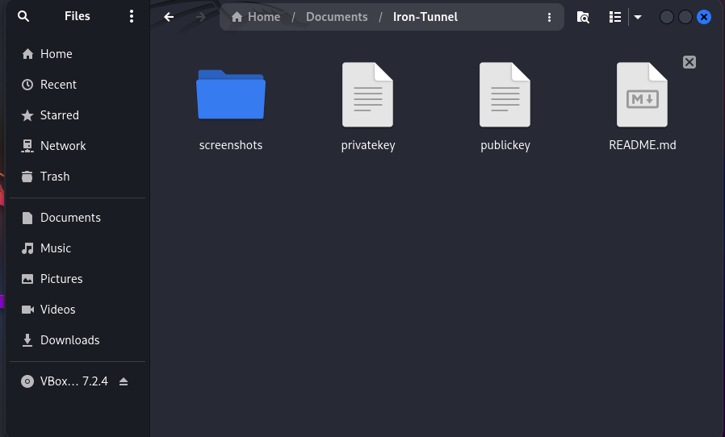
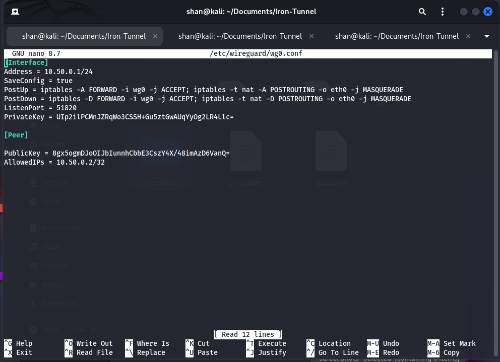
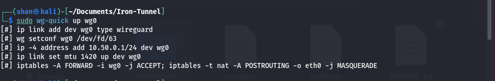
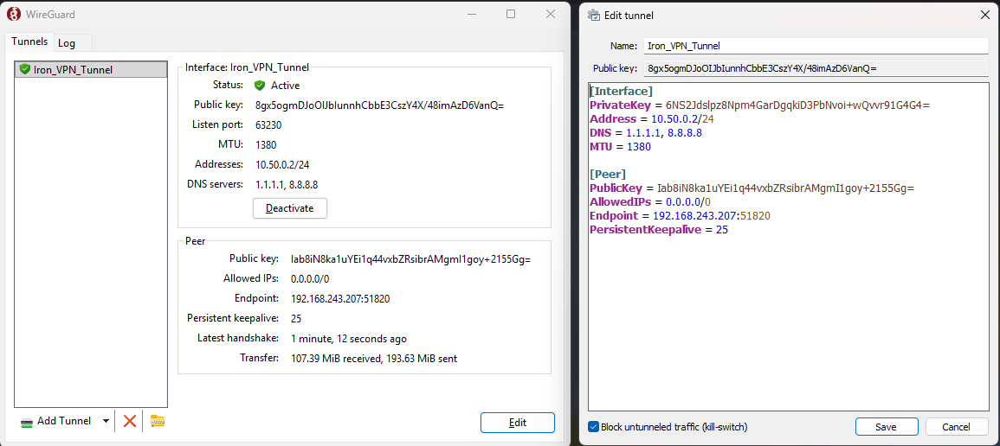
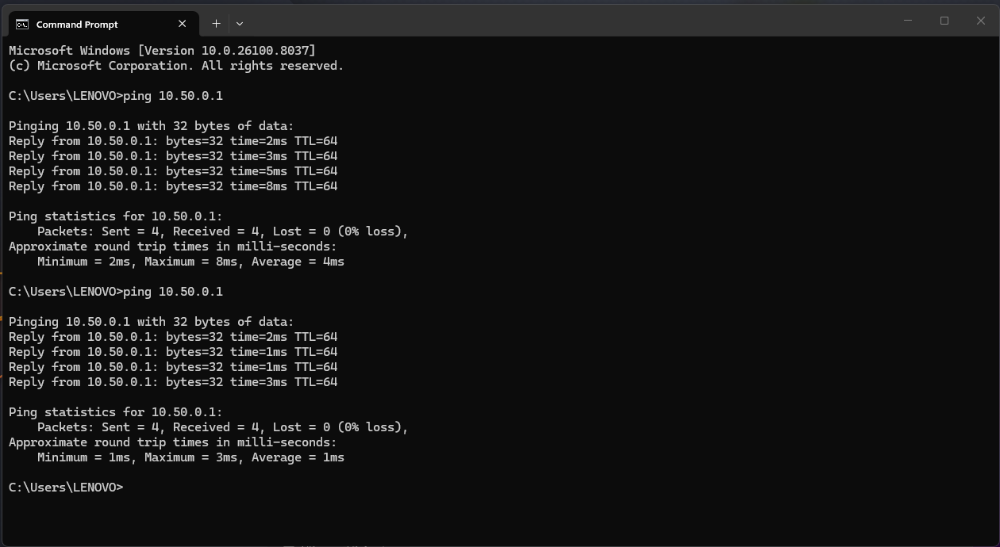
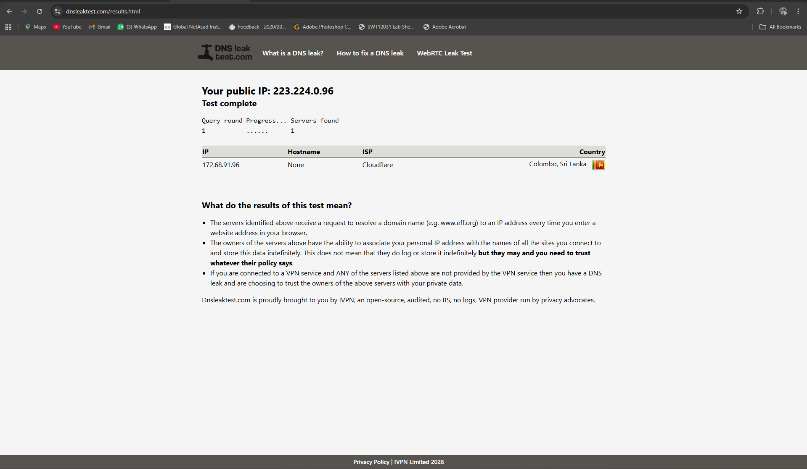

# 🛡️ IronTunnel: Professional WireGuard VPN Gateway Implementation

## Executive Summary
**IronTunnel** is a custom-engineered VPN infrastructure designed to provide a secure, encrypted "pipe" between a Linux-based security gateway and a Windows 11 endpoint. This project demonstrates advanced knowledge of **Network Virtualization**, **Asymmetric Cryptography**, and **Kernel-level Routing**. By transforming a Kali Linux instance into a hardened router, I established a secure exit node for a Windows 11 host.

---

## Architecture & Specs
* **Server OS:** Kali Linux (Rolling) 
* **Client OS:** Windows 11 Pro
* **Protocol:** WireGuard (UDP/51820)
* **Encryption:** ChaCha20-Poly1305 (Symmetric) & Curve25519 (ECDH Key Exchange)
* **Subnet:** `10.50.0.0/24`

---

##  Key Features
* **IP Masquerading (NAT):** Utilizes `iptables` to route traffic through the Kali Gateway's primary network interface.
* **Kernel-Level Forwarding:** Manually tuned `net.ipv4.ip_forward` for high-speed packet routing.
* **Zero-Leak DNS:** Hardcoded Cloudflare (1.1.1.1) and Google (8.8.8.8) resolvers to bypass ISP tracking.
* **Tunnel Optimization:** Configured 25-second heartbeats (PersistentKeepalive) for NAT traversal and optimized MTU (1380).

---

##  Implementation & Configuration

### 1. Cryptographic Identity Generation
The tunnel uses a "Zero-Trust" model. I generated unique Public/Private key pairs to establish a cryptographically secure handshake.

> **Command:** `wg genkey | tee privatekey | wg pubkey > publickey`

---

### 2. Server-Side Infrastructure (Kali Linux)
I configured the `wg0` interface with specific routing rules to handle encrypted traffic and enabled IP forwarding at the kernel level.

> **Command:** `sudo nano /etc/wireguard/wg0.conf`

#### **Service Status & Handshake Proof**
Once the interface was brought up with `wg-quick up wg0`, I verified the active connection and data transfer.

---

### 3. Client-Side Deployment (Windows 11)
The Windows 11 endpoint was configured as a secure node with a full-tunnel **"Kill-Switch"** enabled to prevent IP leaks if the connection is interrupted.

---

## 🔍 Validation & Proof of Concept

### ✅ Connectivity Audit (Ping Test)
I verified the tunnel's integrity via ICMP Echo Requests. The 1ms latency confirms successful packet encapsulation between the `10.50.0.2` client and the `10.50.0.1` gateway.

### ✅ Stealth Audit (DNS Leak Protection)
Verified 100% traffic cloaking. Results confirm that zero ISP data is leaked, with all requests resolving through the encrypted VPN tunnel.

---

## 💡 Skills Demonstrated
* **System Hardening:** Enabling IP forwarding via `sysctl` and ensuring persistence in `/etc/sysctl.conf`.
* **Network Administration:** Managing virtual interfaces, CIDR notation, and subnets.
* **Security Engineering:** Architecting full-tunnel environments and implementing NAT/PAT masquerading.
